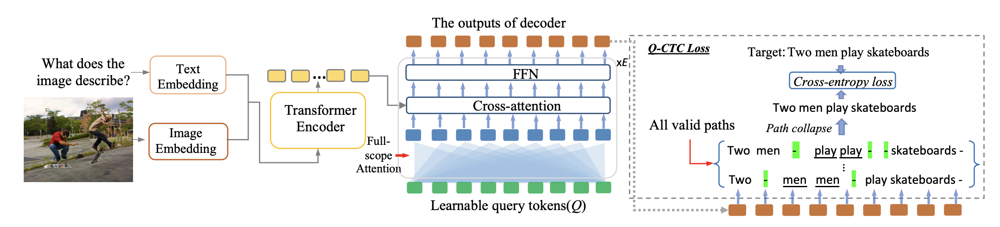
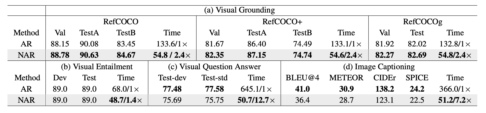

# Non-Autoregressive Sequence-to-Sequence Vision-Language Models

This repo shares the code for CVPR 2024 paper https://arxiv.org/abs/2403.02249.

## Abstract

Sequence-to-sequence vision-language models are showing promise, but their applicability is limited by their inference latency due to their autoregressive way of generating predictions. We propose a parallel decoding sequence-to-sequence vision-language model, trained with a Query-CTC loss, that marginalizes over multiple inference paths in the decoder. This allows us to model the joint distribution of tokens, rather than restricting to conditional distribution as in an autoregressive model. The resulting model, NARVL, achieves performance on-par with its state-of-the-art autoregressive counterpart, but is faster at inference time, reducing from the linear complexity associated with the sequential generation of tokens to a paradigm of constant time joint inference.

## Method



NARVL borrows the encoder from OFA, where the embedding sequence of input text and image CNN (ResNet) feature are concatenated in the input token sequence. Unlike the standard transformer decoder that generates outputs sequentially, conditioning on the generated sequence, our non-autoregressive decoder takes a sequence of tokens that are learnable weights, and generates outputs for all tokens in parallel. As the output sequence length is unknown, we set the number of learnable query tokens to a value (hyperparameter) larger than the largest target sequence length. The loss used, Q-CTC, is described in Eq. 1.


## Results
We show some comparisons of autoregressive bseline vs our proposed non-autoregressive model.




## Installation

```
conda create --name narvl python=3.9 -y
conda activate narvl
cd /path/to/NARVL
pip install -r requirements.txt
pip install -e ./fairseq/
pip install torch torchvision -y
export PYTHONPATH=/path/to/NARVL/fairseq
```

ctcdecode pakcage can be found here: https://github.com/parlance/ctcdecode


## Scripts

Train and evaluation scripts can be found in run_scripts folder.


## Related Projects

- [fairseq](https://github.com/pytorch/fairseq): A PyTorch-based sequence modeling toolkit.
- [OFA](https://github.com/OFA-Sys/OFA): A Unified Transformer for Vision-Language Tasks.


## Citation

If you use this code or the ideas from the paper, please cite:

```
@inproceedings{shi2024non,
  title={Non-autoregressive Sequence-to-Sequence Vision-Language Models},
  author={Shi, Kunyu and Dong, Qi and Goncalves, Luis and Tu, Zhuowen and Soatto, Stefano},
  booktitle={Proceedings of the IEEE/CVF Conference on Computer Vision and Pattern Recognition},
  pages={13603--13612},
  year={2024}
}

```